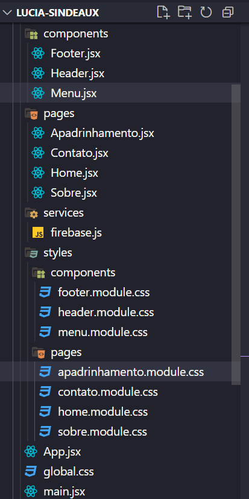

# Resgatinhos - Amor em patas

O site está no ar na vercel atráves desse link: https://projeto-final-resgatinhos-reprograma.vercel.app/

# Projeto Resgatinhos - Amor em patas

Bem-vindo ao projeto Resgatinhos! Este projeto é o resultado da minha conclusão do curso de Front-End e foi criado com o propósito de demonstrar todos os conhecimentos que adquiri ao longo do programa. A ONG _Resgatinhos_, embora fictícia, tem uma missão importante: digitalizar a doação de notas fiscais e facilitar o apadrinhamento de gatinhos, além de proporcionar maior visibilidade e credibilidade para o trabalho da organização, conquistando assim, futuros apoiadores.

# Sobre o Projeto

O objetivo central do projeto é permitir que os apoiadores da ONG Resgatinhos contribuam de maneira prática e eficiente, enviando suas notas fiscais para que possam ser cadastradas no programa Nota Paraná. Além disso, o site proporciona a oportunidade de conhecer alguns dos gatinhos disponíveis para apadrinhamento na seção dedicada a essa causa tão nobre.

Para conhecer mais sobre doação de notas fiscais para ongs pelo nota paraná [clique aqui](https://www.notaparana.pr.gov.br/Pagina/Doacao-notas-fiscais).

# Páginas, componentes e rotas
O site possuí 4 páginas: Home, Sobre, Apadrinhamento e Contato e 3 componentes Menu, Footer e Header.

# Tecnologias usadas no projeto

O Resgatinhos foi desenvolvido com as seguintes tecnologias:

- [x] **ReactJS** Foi a tecnologia escolhida para criar todo o site da ONG.
- [x] **Axios**  É usado para consumir uma API pública que mostra os gatinhos para apadrinhamento.
- [x] **Firebase** É usado para salvar as NF's enviadas para doação e também o usuário pode entrar em contato com a ONG através de um formulário. 
- [x] **ReactJS** Foi o framework escolhido para criar todo o site da ONG;
- [x] **Vite** Ferramenta de estrutura utilizada com react;
- [x] **NPM** Gerenciador de pacotes utilizado no projeot;
- [x] **Axios**  É utilizado para consumir uma API pública que mostra os gatinhos para apadrinhamento;
- [x] **Firebase** É utilizado para salvar as NF's enviadas e o usuário poder entrar em contato com a ONG;
- [x] **React router dom** Dependência usada para criar rotas no Reactjs;
- [x] **React-Icons** Dependência usada para colocar icones lindos no projeto;
- [x] **Vercel**  É utilizado para Hospedagem para a aplicação, fiz o deploy integrado com o github.

 
# Como rodar o projeto localmente
Siga o passo a passo a seguir:
<table>
  <thead>
<th>Passo	</th>
<th>Comando</th>
  </thead>
    <tbody>
    <tr>
      <td>Faça o fork do projeto</td>
	    <td>botão de forkar</td>
    </tr>
      <tr>
      <td>Faça o clone do projeto</td>
	    <td>git clone</td>
    </tr>
	 <tr>
      <td>Instale as dependências após acessar a pasta projeto</td>
	    <td>npm i</td>
    </tr>
    <tr>
      <td>Crie as variaveis de ambiente para integrar com Firebase e inclua os valores da sua conta	conforme</td>
	    <td> Conforme .env.example do projeto</td>
    </tr>
   <tr>
      <td>Rode o projeto na sua máquina</td>
	    <td> npm run dev</td>
    </tr>	
    </table>

# Quem sou eu?

Olá! Meu nome é Lúcia, sou estudante de Front-End na Reprograma e sou apaixonada por tecnologia desde criança! Atualmente, estou cursando Análise e Desenvolvimento de Sistemas e **trabalho com QA Jr** _(a reprograma foi essencial para eu conseguir esse emprego)_ onde tenho a oportunidade de aprender muito sobre Desenvolvimento de software, Testes e metodologias ágeis. 
Meu objetivo é aprimorar minhas habilidades em tecnologia e me tornar um profissional altamente qualificada. Dedico meu tempo livre para estudar e praticar novas tecnologias para me manter atualizada com as últimas tendências do mercado.

# Me encontre nesses lugares

Ficou interessado no projeto ou tem alguma dúvida? Se conecte comigo nessas redes:

- [E-mail](luciasindeaux@gmail.com)
- [LinkedIn](https://www.linkedin.com/in/luciasindeaux)
- [GitHub](https://github.com/LuciaSindeaux)

